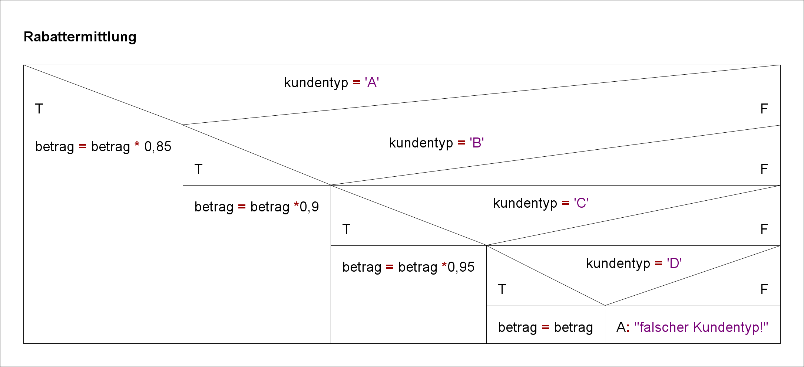

# Verschachtelte Verzweigungen und Fallunterscheidungen 

In vielen Fällen gibt es für den Programmablauf nicht nur zwei, sondern mehrere Alternativen. Für solche Probleme können If-Anweisungen beliebig ineinander verschachtelt werden, so dass das Ziel des True- und oder des False-Zweigs einer Verzweigung wiederum eine if-Anweisung ist. Ein Beispiel dafür wäre ein Ausbau des Zahlenratespiels vom letzten Informationblatt: Der Benutzer soll nun eine Hilfe bekommen, wenn er eine falsche Zahl eingibt:
```
public class GuessGame{
    public static void main(String args[]){
        int numberToGuess, input;
        Scanner sc = new Scanner(System.in);
        numberToGuess = 6;
        System.out.print("Gib eine Zahl zwischen 1 und 10 ein: ");
        input = sc.nextInt();
        if (input != numberToGuess) {
            if (zuRatendeZahl < eingegebeneZahl){
                System.out.println("Leider liegst Du zu hoch.");
            }
            else{
                System.out.println("Leider liegst Du zu niedrig.");
            }            
        }
        else{
            System.out.println("Richtig!");
        }
    }
}
```
### Das Dangling-Else-Problem
Bei Verzweigungen mit else gibt es ein bekanntes Problem, das Dangling-Else-Problem genannt wird. Es betrifft die Frage, zu welchem if ein bestimmtes else gehört, wenn ohne geschweifte Klammern gecodet wird: 
```
   if(Ausdruck1)
     if (Ausdruck2)
       Anweisung1;
   else
     Anweisung2;
```
Die Einrückung suggeriert, dass das else die Alternative zur ersten if-Anweisung ist. Dies ist aber nicht richtig. Die Semantik von Java (und auch fast aller anderen Programmiersprachen) ist so definiert, dass das else zum innersten if gehört. Daher lässt sich nur der Programmiertipp geben, die if-Anweisungen zu klammern, um das else der ersten If-Anweisung zuzuordnen:

```   
   if ( Ausdruck1 )
   {
     if ( Ausdruck2 )
     {
       Anweisung1;
     }
   }
   else
   {
     Anweisung2;
   }
```
### Fallunterscheidungen mittels if-else-Leiter
Häufig müssen Programme eine Auswahl unter beliebig verschiedenen Alternativen treffen. Solche so genannten Fallunterscheidungen können mit einer if-else-Leiter umgesetzt werden. Ein Beispiel wäre die Ermittlung eines Rechnungsendbetrags unter Berücksichtigung verschiedener Rabatte. Dabei soll folgende Rabattstaffel gelten:

Kundentyp | Rabattsatz
---|---     
A | 15% 
B | 10% 
C | 5% 
D | 0%  

Bei Fallunterscheidungen ist das Ziel der jeweiligen else-Zweige wieder eine if-Anweisung (vgl. Struktogramm). Das letzte else arbeitet in der Regel den Default-Fall ab.  


```
if (type == 'A')
    amount = amount*0.85;
else if (type == 'B')
    amount = amount*0.9;
else if (type == 'C')
    amount = amount*0.95;
else if (type == 'D')
    betrag = betrag;
else
    System.out.println("Falscher Kundentyp!");
    
```
In der angegebenen Reihenfolge wird ein Vergleich nach dem anderen durchgeführt. Bei der ersten Bedingung, die true ist, wird die zugehörige Anweisung abgearbeitet und die Mehrfach-Selektion abgebrochen. Dabei kann statt einer einzelnen Anweisung stets auch ein Block von Anweisungen (mehrere Anweisungen, die mit geschweiften Klammern zusammengefasst sind) stehen, da ein Block syntaktisch einer einzigen Anweisung gleichgestellt ist. Der letzte else-Zweig ist optional. Hier können alle anderen Fälle behandelt werden, die nicht explizit aufgeführt wurden. Ist dies nicht notwendig, so kann der else-Zweig entfallen. 
Dieser else-Zweig wird oft zum Abfangen von Fehlern, z.B. bei einer Benutzereingabe, verwendet. Betätigt der Benutzer eine ungültige Taste, kann er in diesem else-Teil „höflichst“ auf sein Versehen hingewiesen werden.

### Fallunterscheidungen mittels switch-case
Die Fallunterscheidung oder switch-Anweisung stellt eine Alternative zur if-else-Leiter dar, um in verschiedene Alternativen verzweigen zu lassen. Die switch-Anweisung testet keine Bedingungen, sondern den Wert einer Variablen oder eines komplexen Ausdrucks. Je nach Wert des so genannten „Selektors“ werden dabei unterschiedliche Anweisungen ausgeführt. Der Ergebnistyp des Selektors muss char, byte, short, int oder String sein, d.h. die Fallunterscheidung ist nicht bei Gleitkommazahlen anwendbar. 

#### allgemeine Syntax:
```
switch (selektor){
    case 1: Anweisung1; 
            break;
    case 2: Anweisung2; 
            break;
	…
    default Anweisung;
}
```

Das Schlüsselwort switch leitet die mehrseitige Auswahl ein. Die mit dem Schlüsselwort case eingeleiteten Konstanten, die nur einen einzelnen Wert annehmen können, mit nachfolgendem Doppelpunkt legen Einsprungsmarken für den Programmablauf fest. Je nach Wert des Selektors springt das Programm in den besonderen Fall und führt ab dort alle nachfolgenden Anweisungen der switch-Anweisung aus. Dieses geschieht, bis auf eine break-Anweisung gestoßen wird, mit der die switch-Anweisung verlassen wird. Sollen in einem Fall mehrere Anweisungen ausgeführt werden müssen sie mittels geschweifter Klammern ({}) zu Anweisungsblöcken zusammengefasst werden. Wird das Ergebnis des Selektors nach keinem case gefunden, wird die default-Anweisung ausgeführt. Diese ist optional. Am Beispiel der Rabattstaffel von oben:
```
switch (type){
    case 'A':{
        amount = amount*0.85;
        break;
    }
    case 'B':{
        amount = amount*0.9;
        break;
    }
    case 'C':{
        amount = amount*0.95;
        break;
    }
    case 'D':{
        amount = amount;
        break;
    }
    default:{
        System.out.println("Falscher Kundentyp!");
    }
}
```
Die switch-case-Anweisung eignet sich in allen Fällen von Fallunterscheidungen, wo die einzelnen Fälle jeweils von genau einem Wert abhängen, wie im Beispiel der Buchstabe der Kundenkategorie. Würde man die Rabatte anhand von Rechnungsbeträgen ermitteln (z.B. alle Kunden, die für mehr als 10.000 EUR einkaufen, erhalten 15% Rabatt), wäre switch-case ungeeignet, weil es mehrere Beträge gibt, für die 15% Rabatt berechnet werden müssen. Um Intervalle auseinander zu halten, eignen sich if-else-Leitern besser. 